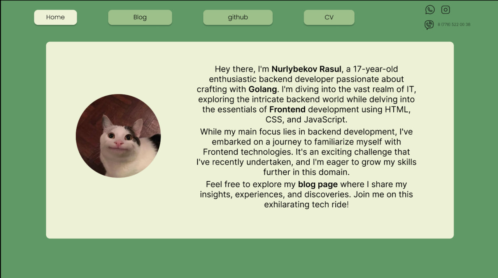

# Стек
* Golang(babyapi, go-htmx)
* html css
* SQL

$Links$
* from https://github.com/rusisg/personal-website-temp
* https://github.com/calvinmclean/babyapi
* for SQL https://www.geeksforgeeks.org/how-to-design-database-for-a-blog-website/
* https://dev.to/calvinmclean/how-to-build-a-web-application-with-htmx-and-go-3183
* https://pkg.go.dev/text/template

$Look:$
